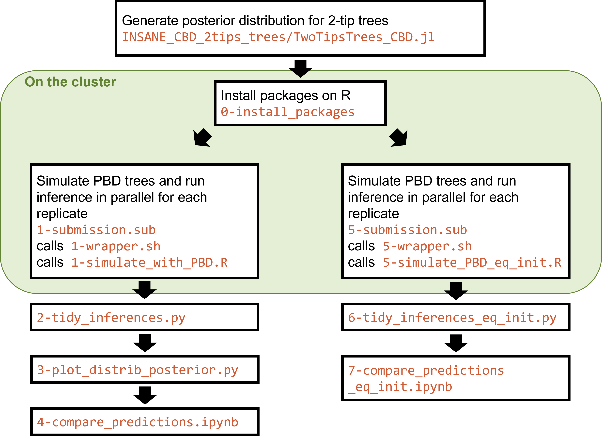

# scripts to fit a constant-rate birth-death (CBD) model to trees simulated from the PBD model, with Bayesian approach
## Path
``` 
PBD_bayesian_fit_CBD
```

## Overview
These scripts generate trees under a PBD model and estimate CBD rates on these trees 
with Bayesian approach. 

They are intended to be run on the cluster "bioclust". 



## Files
* `0-install_packages.R`: install the required packages on the used environment
* `1-simulate_with_PBD.R`: simulate the trees and infer the BD rates. This script only runs 1 replicate for several values for the parameters $\lambda_1, \lambda_2, \lambda_3, \mu_1, \mu2$. Takes external arguments:
    * id of the replicate (change the seed and name of the stored files)
    * path to store the output files. 
    
    For instance 
```
Rscript ./1-simulate_with_PBD_bioclust.R 1 /data/biodiv/pveron/PBD_analog/out
```
* `1-wrapper.sh`: a wrapper to call the script `1-simulate_with_PBD_bioclust.R` in the right environment and with the right arguments
* `1-submission.sub`: submission file to run the whole process on the cluster, with several replicates, each replicates changes the id that is passed as argument to the script `1-simulate_with_PBD.R`.
* `2-tidy_inferences.py`: script to put all the replicates in a unique `.csv` file. 
* `3-plot_distrib_posterior.py`: plot stacked posterior distributions of the inferred birth, death, diversification and turnover rate for each combination of parameters and compare it with the prediction. Generates figures in `fig/distrib_posterior` folder. 
* `4-compare_predictions.ipynb`: plot the posterior distributions of the rates and compares them to the predictions. 
* Files ending with `eq_init`: same analysis as for files `1-` to `4-`, but with $\lambda_1 = \lambda_3$. 

## Output 
The scripts `1-simulate_with_PBD.R` and `5-simulate_PBD_eq_init.R` generate several output files:
* `igtree.extinct-parX-varY-repZ.rds`: the PBD tree with all lineages (incipient and good, extinct and extant), in `RDS` format (must be opened with `R`), with 
    * `X`=1,2,3,4,5 indicated which parameter varied in this simulation 
    * `Y` is the index of the value taken by the parameter 
    * `Z` is the ID of the replicate
* `stree_random-parX-varY-repZ.nwk` the reconstructed species tree in Newick format
* `mcmc-parX-varY-repZ.csv` the MCMC samples posterior generated by the Bayesian fit of the tree to a pure BD model. If the tree has less than 3 species, this file is not generated. 
* `all_simulations_inference-rep-Z.csv` a csv file summarizing the simulations for the replicate `Z`. 

The scripts `2-tidy_inferences.py` and `6-tidy_inferences_eq_init.py` generates the output:
* `all_simulations_inference.csv` a csv file summarizing all the replicates.
* `summary_all_MCMC.csv` a csv file summarizing all the rates (mean, median, sd, ...) inferred accross the MCMC chain and accross the replicates.
* `boxplot-R-parX-varY.json` json files containing the data required to draw boxplots containing the BD rates for each values of each parameters (`R = l`, `mu`, `div` or `turnov`). See Matplotlib [doc](https://matplotlib.org/stable/api/cbook_api.html#matplotlib.cbook.boxplot_stats) for the syntax.


## Runs 
On the cluster (only once)
```
# on the cluster
Rscript ./0-install_packages.R
```
then 
```
# on the cluster
condor_submit submission.sub 
```

Adapt the `2-` and `3-` Python scripts to specify where are stored the output and the number of replicates and run
```
# on the cluster OR locally
python ./2-tidy_inferences.py
python ./3-plot_distrib_posterior.py
```

## Specific case of trees with only two tips
Among simulated reconstructed trees, diversitree does not allow CBD inference to be performed on those with only two tips. This analysis is therefore performed with the julia package Tapestree (branch [INSANE](https://github.com/ignacioq/Tapestree.jl/tree/insane)). The script and results can be found in the `INSANE_CBD_2tips_trees` directory, and the posterior parameters in `two_tip_posterior`. In `Julia`, run first:

```
using Pkg
] add Tapestree#insane
```
Then run the script `INSANE_CBD_2tips_trees/TwoTipsTrees_CBD.jl`. 

## History
* 2024/02/21 run 100 replicates with cluster id `12038`. 
Changed the values taken by $\lambda_3$ because too high values did not run (large trees).

* 2024/02/27 run 200 replicates with larger tree size (`age = 8`) and smaller rage of the rate of initiation. Cluster id `12149`, Git version `c4c04d6`.

* 2024/02/28 run CBD inference with Tapestree.jl on two-tip trees of root age 8

* 2024/03/01 Cluster id `12152`, Git version `6da9e79`:
    *  run 200 replicates with larger tree size (`age = 15`).
    *  run CBD inference with Tapestree.jl on two-tip trees of root age 15

* 2024/03/01 Cluster id `12183`, Git version `b982816`: run 200 replicates for equal rates $\lambda_1 = \lambda_3$. 